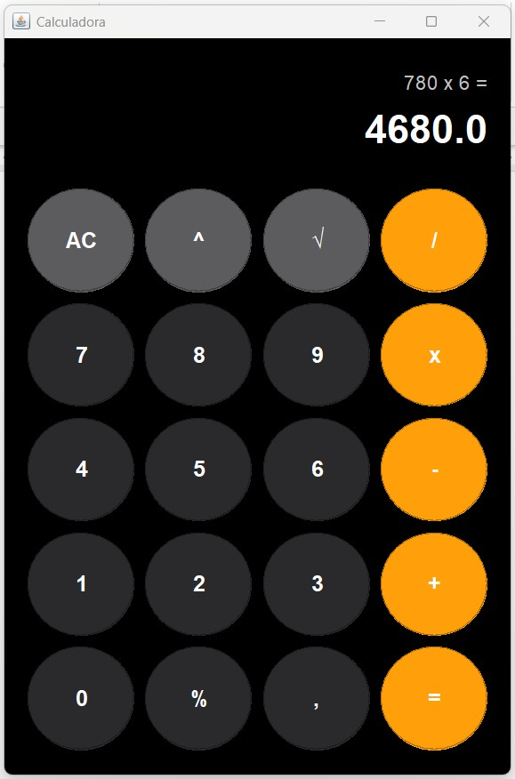

# Actividad Aplicada al Curso de *POO*

## Propósito
  - Comprender y aplicar los principios fundamentales de la programación orientada a objetos.
  - Desarrollar habilidades prácticas en el uso de métodos, clases y objetos para la solución de problemas de software.
  - Promover la responsabilidad y el compromiso en el desarrollo de aplicaciones de calidad respetando normas y estándares en el sector tecnológico

## Descripción
Desarrollar una aplicación de software básico en **Java** que permita hacer operaciones de *multiplicación*, *división*, *suma*, *resta*, *potenciación* y *radicación*

## Resultado

    

## Corporación Unificada Nacional de Educación Superior - CUN
- Docente: **Andrés Felipe Montoya Rivera**
- Semestre: **II**
- Curso: **Programación Orientada a Objetos I**

## Stack de Tecnología
- IDE: **Apache NetBeans IDE 23**
- Lenguaje de Programación: **Java** Versión 21.0.6